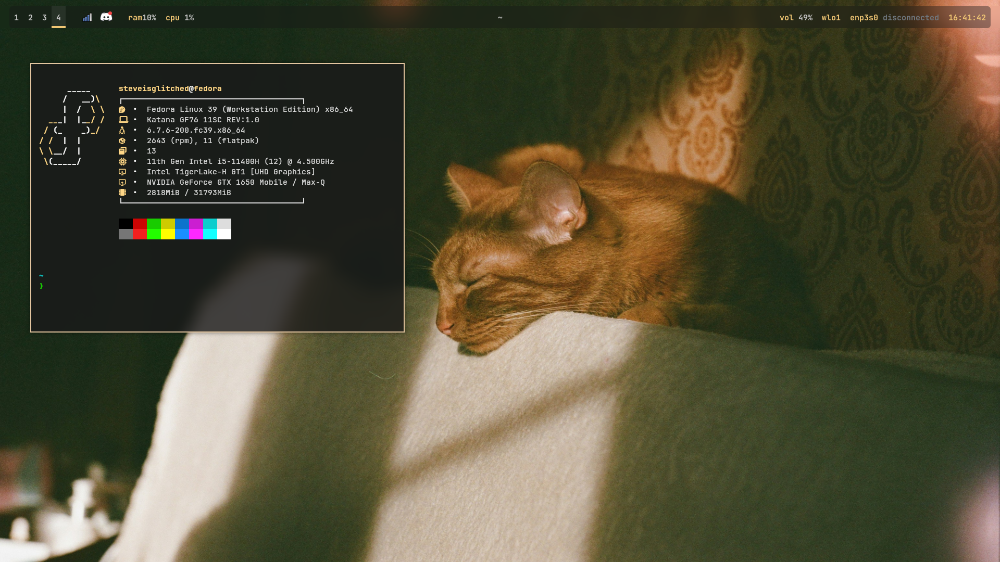
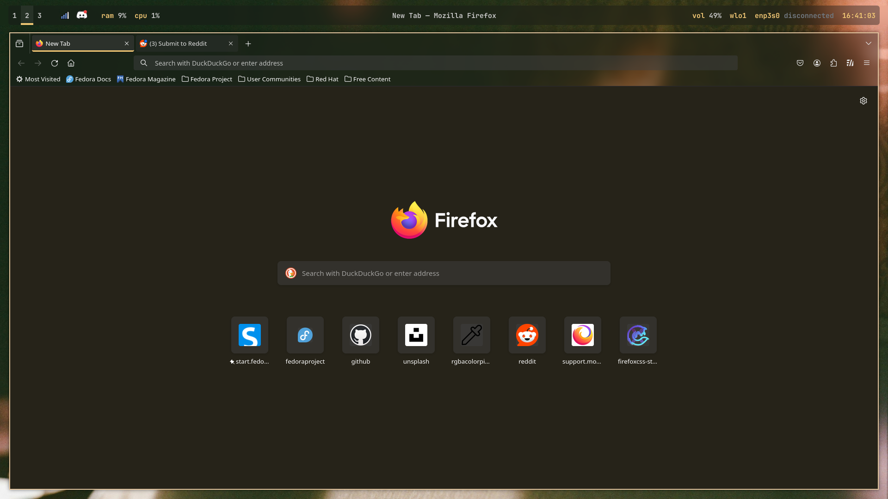
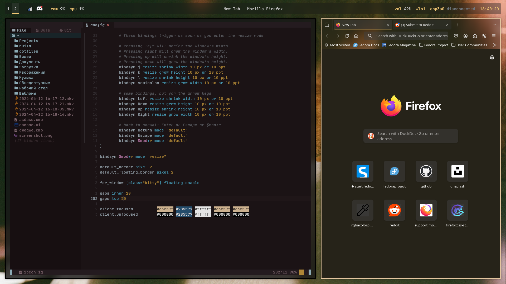

# Fedora i3wm dotfiles
Another repository/branch with dotfiles that feature custom Firefox theme; rofi, polybar themes; i3wm, AstraNvim, neofetch, fish and picom configurations.

## Introduction
The previews are available below and the `preview` folder. The `config` folder contains all the dotfiles. i3-gaps, polybar, rofi, neovim, astranvim, firefox, fish, starship and picom is needed for a full configuration.
The `chrome` folder is what you should paste to root directory of Firefox.
You can find it in about:profiles, and it should be something like `~/.mozilla/firefox/XXXXXXXX-default-release/`.

