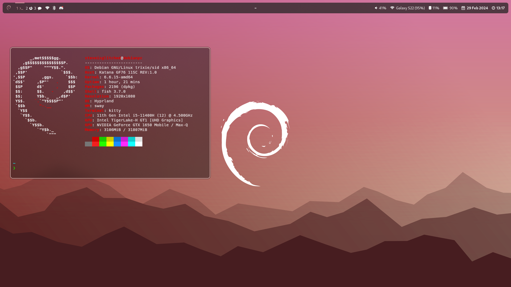
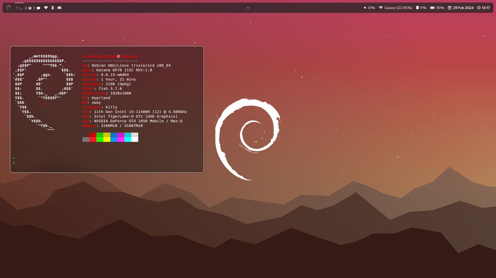
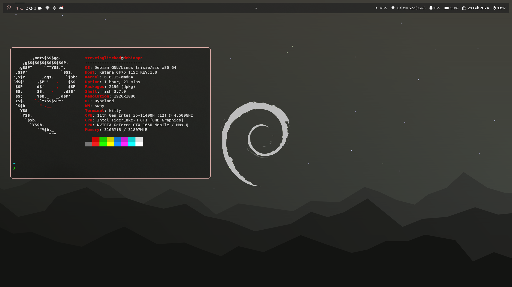

# Debian Rice
Welcome to my Debian dotfiles!  

Currently not finished, missing rofi dotfiles. Repo does include very simple script called "dynapaper.sh" that will change your wallpaper depending on time of the day, and the debian wallpapers itself. If you want to disable it, remove "exec-once" line in hyprland.conf. 

Credits to wallpaper creator, Alex Makas; I have modified those wallpapers' colors, decorations in GIMP. 

Preview
Day

Evening/morning

Night

